# CMOS-inverter
### Design and Analysis of CMOS inverter using LT-Spice and TSMC 180nm.lib
***
***This is my first repository and i hope to post more projects and electronic simultaions,vlsi stuffs. I do appreicate contributions from others during this phase of learning.I will try to keep updating it as often as possible.***
***

This project describes the working of the basic inverter, its characteristics,input-output relations, parameter varations etc.. i have used LT-spice for my simulation of the circuits and to also to analayse and verify the outputs. Ive included the tsmc180nm tech/model file in my simultaions.
I always aim to understand the the circuits,devices right from the basic and then progress to the higher levels, Here in this project to I've aimed to acomplish the same.The projects kicks of from the Voltage Tranfer Characterstics,Transient Analysis and also the Power Dissipation associated eith the inverter.So lets jump right in to it.

**Note:-
      PMOS width Wp=800nm and NMOS width Wn=400nm** 
      Ive kept these width through out the project.
***
### Contents

- [ 1. INVERTER Design and Analysis ](#1-INVERTER-Design-and-Analysis)
  - [1.1 CMOS Inverter](#11-CMOS-Inverter)
  - [1.2 Inverter Symbol](#12-Inverter-Symbol)
  - [1.3 Voltage Transfer Characteristics (VTC)](#13-Voltage-Transfer-Characteristics-(VTC))
- [2. Parameter Variations and its Analysis](#2-Parameter-Variations-and-its-Analysis)
  - [2.1 VDD Variation](#21-VDD-Variation)
  - [2.2 PMOS Width(Wp) Variation](#22-PMOS-Width(Wp)-Variation)
  - [2.3 NMOS Width(Wn) Variation](#23-NMOS-Width(Wn)-Variation)
- [3. Power Dissipation](#3-Power-Dissipation)
  - [3.1 Static](#31-Static)
  - [3.2 Dynamic(Ideal Condition)](#32-Dynamic(Ideal-Condition))
  - [3.3 Dynamic(Practical Condition)](#33-Dynamic(Practical-Condition))
***

## 1. INVERTER Design and Analysis
###### 1.1 CMOS Inverter
The two networks that make up CMOS circuits are typically referred to as a pull up network and a pull down network, respectively. P-channel MOSFETs make up the first set, followed by N-Channel MOSFETs. Simple explanation One transistor turns on while the other is off. By doing so, the problem of a resistive path to the ground is resolved, and no voltage division results (At least not a significant one). In this manner, a Strong High and a Strong LOW can be produced from the same network with ease. The low resistance paths to the VDD and GND are provided via PULL UP and PULL DOWN, respectively. 
 
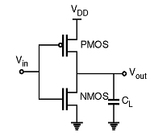 

Initially lets create and inverter in Ltispice including the technology file.The CMOS circuit is formed as shown in the below figure.The width of the PMOS is always kept double to the NMOS width in order for matching currents and other characteristicxs,since mobility of holes is less then the mobility of electrons. 
I've specified the I/O pins VIN,VOUT,VDD,GRND) to the inverter by specifying this i can form thr inverter symbol in the later stage. 
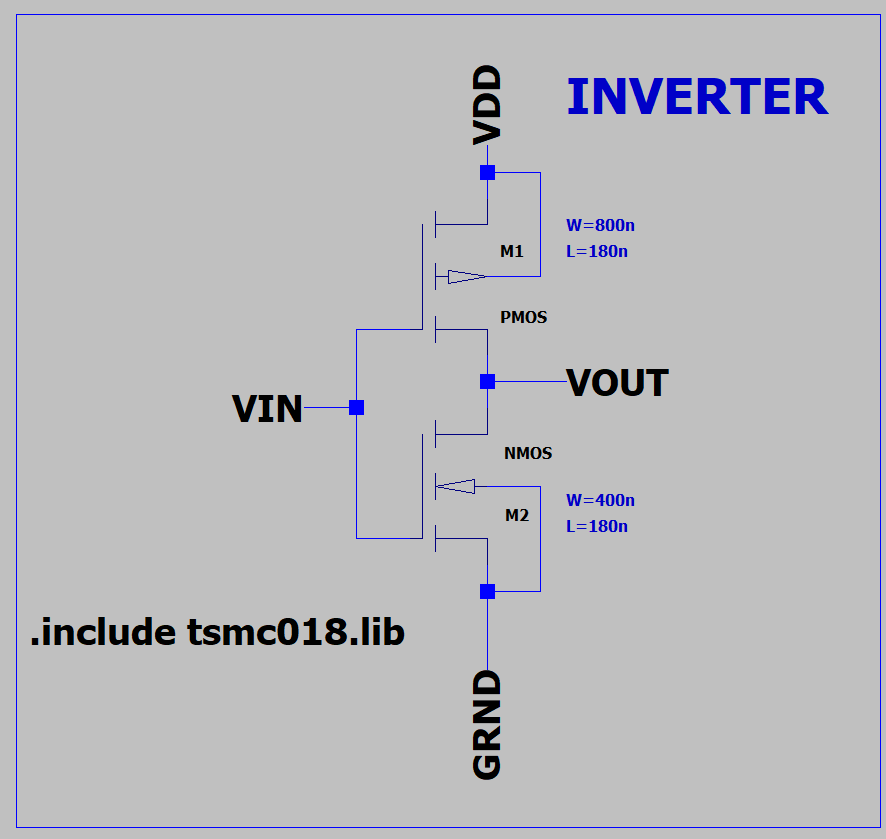 
 
***
After the inverter schematic is done,we move on to the Symbol creation.LT-Spice gives an option to create your own symbol and instance it your schematic.Later after creation of symbol I specified the symbol I/O pins. The text in blue you see is the Comment.We would be doing all our simulations and analysis using this. 
###### 1.2 Inverter Symbol
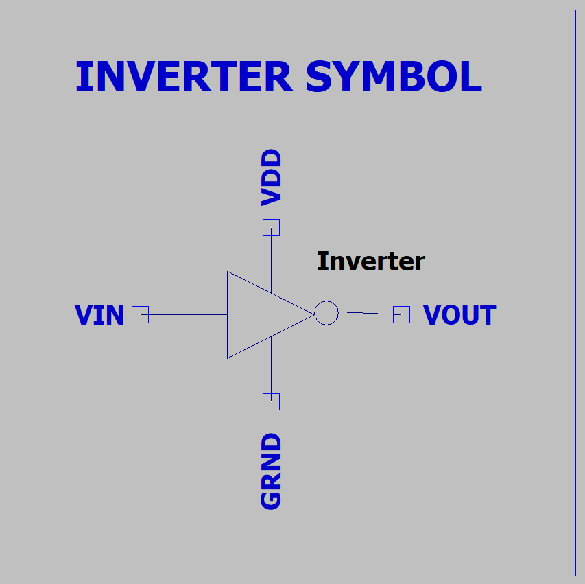 
***
###### 1.3 Voltage Transfer Characteristics (VTC)
A voltage transfer characteristic plots a graph  depicts how a device behaves when its input is altered (full swing). It illustrates what transpires to the output as the input varies. In our example, we can see a plot for an inverter that resembles a non-ideal square wave and changes in nature . So, it is possible to say that the VTC curve can be divided into three regions: the region of high output, the region of transition, and the region of low output. However, there are actually five operational areas, and they are based on how inverter components—NMOS and PMOS transistors—work with respect to changes in input potential. 

 
Keeping the voltage VDD at 1.8V Perform a DC sweep at the input V-GS from 0 to 1.8V.I got the VTC curve,as many would argue the VTC curve needs to be more bent or curvy etc etc..It need not be!!.If i vary the width of the pmos it would. But since its double of nmos its the output i got.This VTC curve teells a lot of things .We can seee the NMOS being off till it reaches Vtn(threshold voltage of NMOS) ,and it gets turned on in saturation region and gradully moves towards linear regionof operation.There's one particular point at which both NMOS and PMOS goes to saturation region of operation.The volatge can be calculated using the formula. 
      **-- Vm=(VDD-|Vtp|+Vtn*sqrt(Bn/Bp))/1+sqrt(Bn/Bp) --**
               
**Schematic**
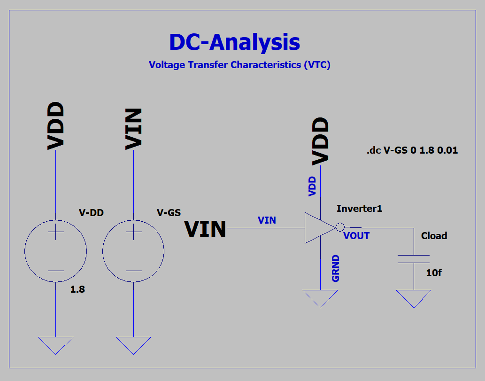 
**Output**
 

## 2. Parameter Variations and its Analysis
We plotted the the VTC curve,now lets vary differrent parameters and check how will it effect our vtc curve.Lets the check the curve by varying **VDD,WIDT,CLOAD** etc.
Most importantly we need to see the varaitions and see what it indiactes.
###### **2.1 VDD Variation**
VDD is varied in the step size and e=we get to see the follwing curve.Scaling the supply voltage means reducing the signal swing.

**Schematic**
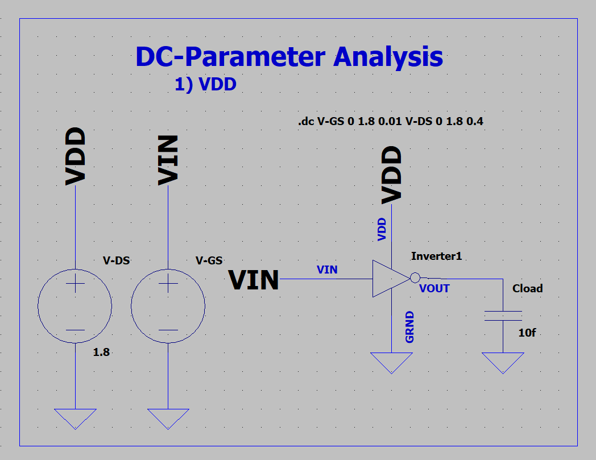 
 
**Output**
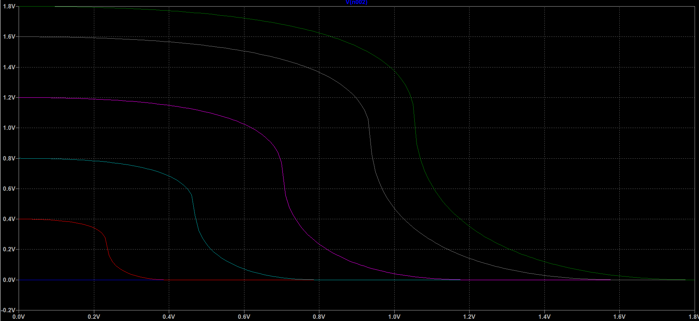 
 
The result is as desired its reduced voltage swing.In later section or different repo ill show what is the minimum voltage that has to be maintained to get the swing. 

***

###### 2.2 PMOS Width(Wp) Variation
 

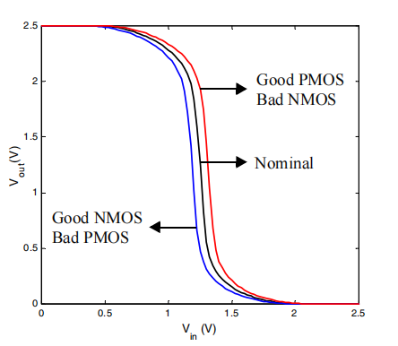 
The VTC curve doesnt change with the Beta-Ratio it only cuases a shift in swithing threshold.Operation of the gate is not effected by any means.Usually the nominal value is considered based on the design requirements.As indicated varying the pmos width we get better pmos that is better pull up network but a bad pull down network and is a vice-versa when nmos width is varied.So trade off is usually made. 

In the follwing section ive separeately simulated the effect for pmos and nmos.Using the .step tool provided by Lt-spice i varied the width in step size. 
 
**Schematic**
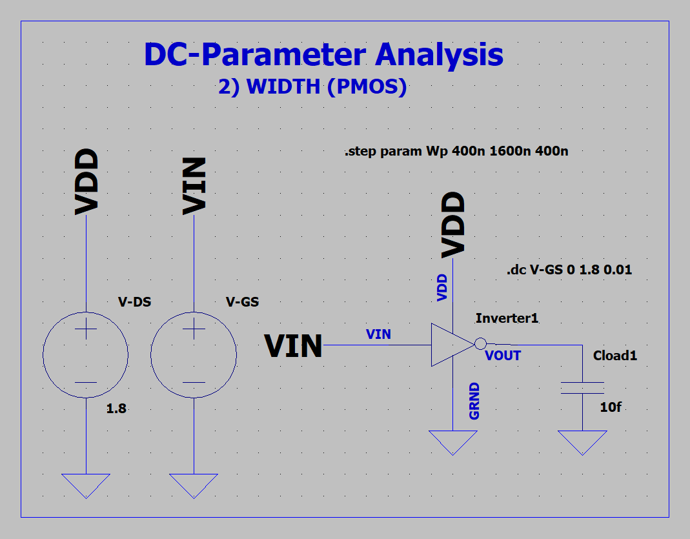 
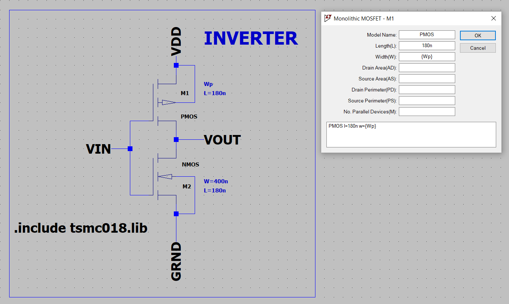 
 
**Output**
 
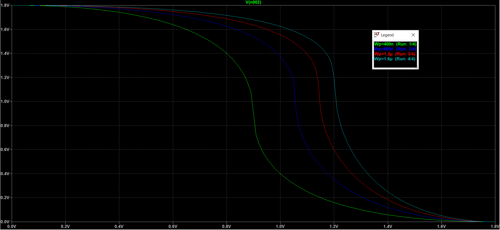 
***
###### 2.3 NMOS Width(Wn) Variation
**Schematic**
 
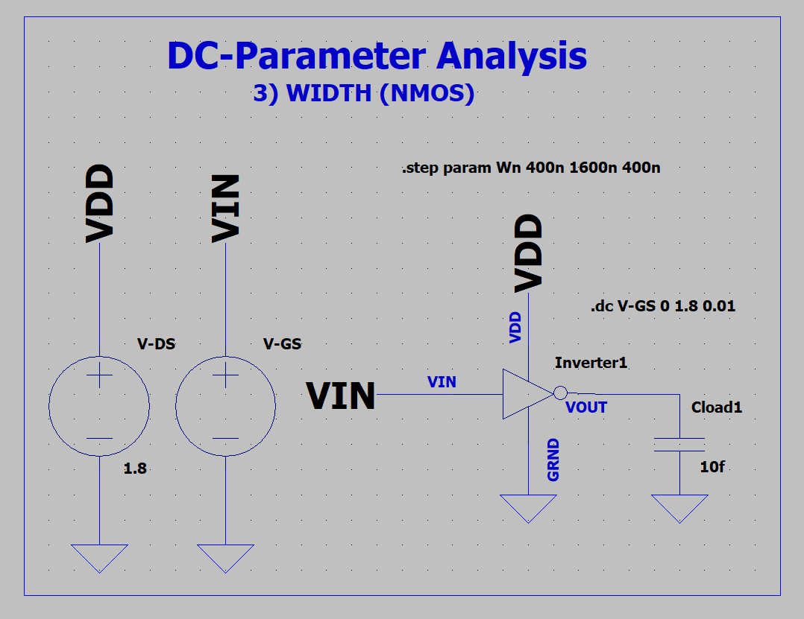 
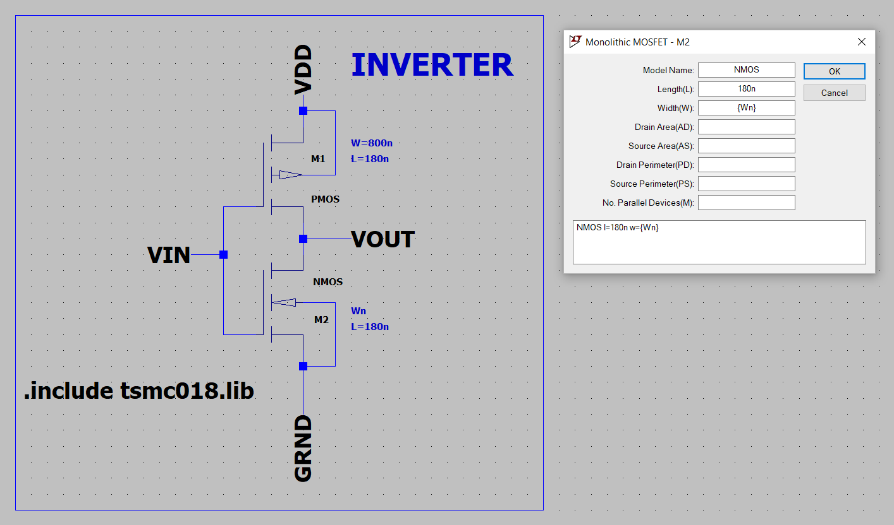 
 
**Output**
 
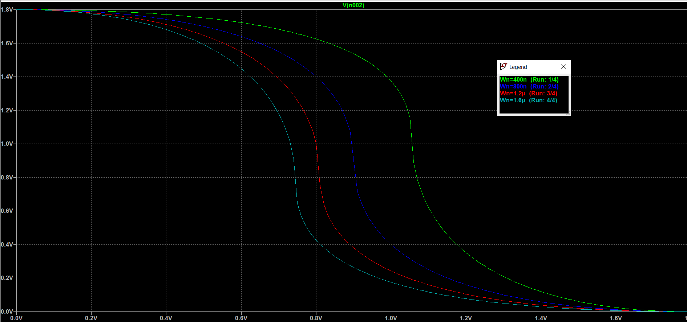 
***
## 3. Power Dissipation
Power dissipation in CMOS is one of the most important factors that needs to be considered.Lets brush upon the different factors and types of power dissipation. 
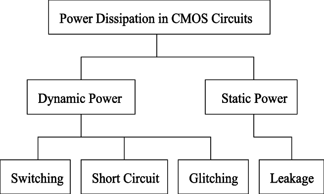 
***
###### 3.1  Short-circuit power
short-circuit power dissipation is induced from the concurrent activation of both the NMOS and PMOS transistors.When the logic changes its state, there is a short window of time where the PMOS and NMOS transistors are switched on simultaneously. A direct current path connecting VDD to the ground is produced within this interval, resulting in short-circuit power dissipation.The power produced does not deliver any meaningful activities at the output and is therefore wasted. 
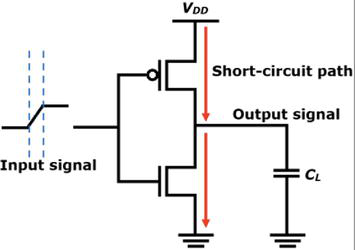 
Below shows the schematic and also the power dissipation curve.I also plotted the the current curve.You could see as the nmos pmos is both turned on in region 2,3,4 and theres a path for teh current flow.The third plot indicates the power dissipated in the inverter when the input voltage swings 0 to VDD.
**Schematic**
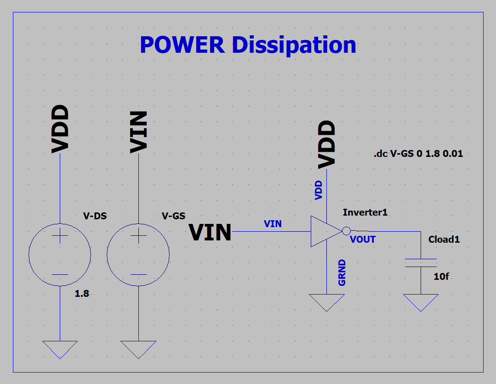 
**Output**
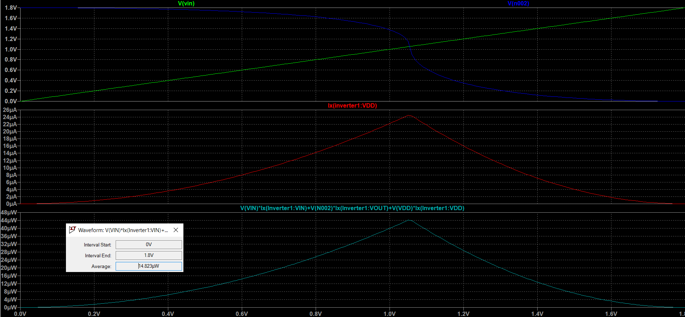 
One other important dissipation factor is the **Static Power Dissipation**. 
Static power Pstatic refers to the power lost when the CMOS circuit is dormant. The main culprit of Pstatic is the leakage current, which exists mainly because of the short-channel effects.Ideally its considered to be zero.The equation is represented as. 
**P(static)=VDD⋅I(leakage)** 

###### 3.2 Switching power(ideal input)
The energy delivered to a CMOS circuit can be classified into two parts, namely, the charging and discharging of the load capacitance CL.During these conditions there is power dissipated in the circuit.
**Schematic**
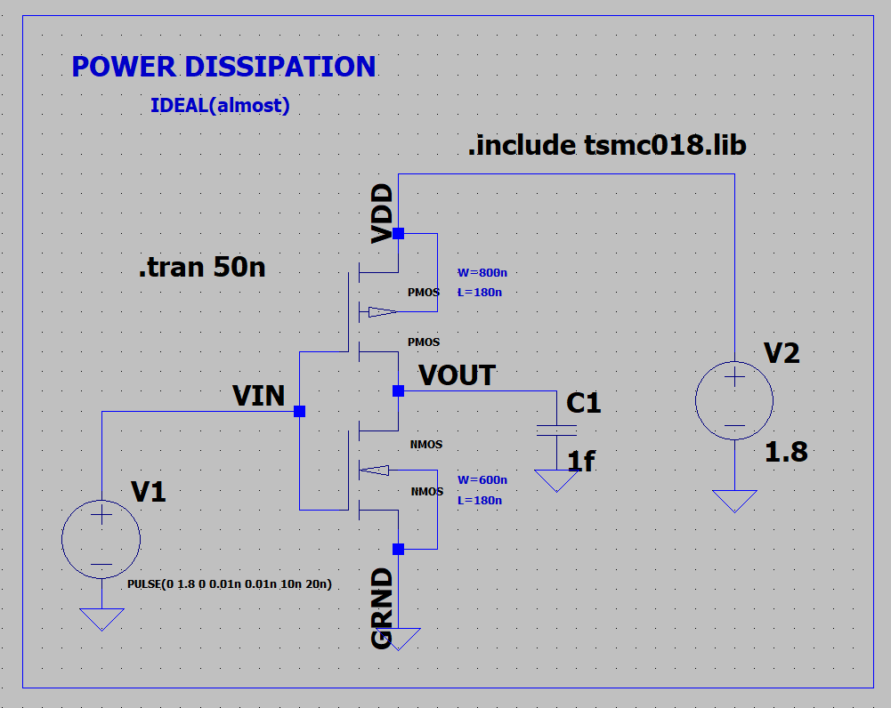 
**Output**
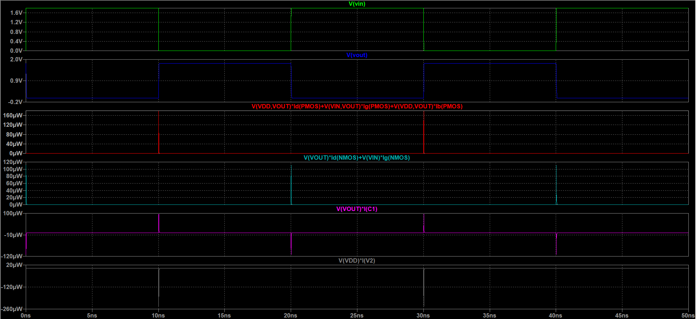 

###### 3.3 Switching power(practical input)
**Schematic**
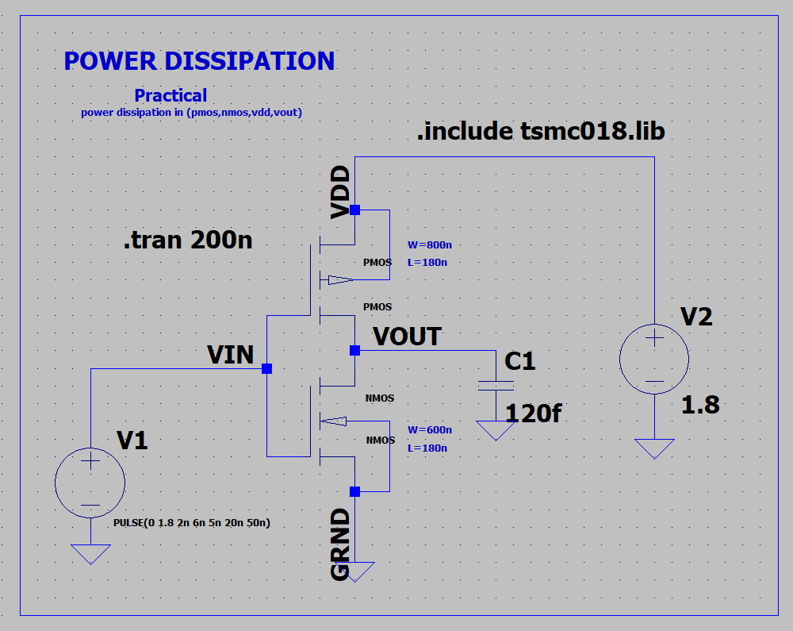 
**Output**
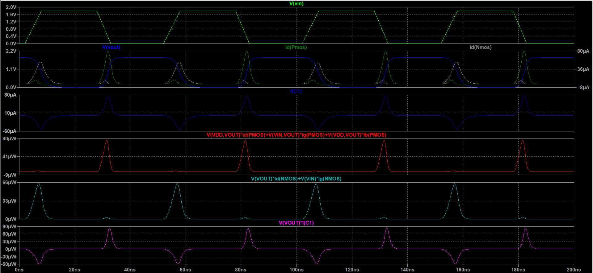 
