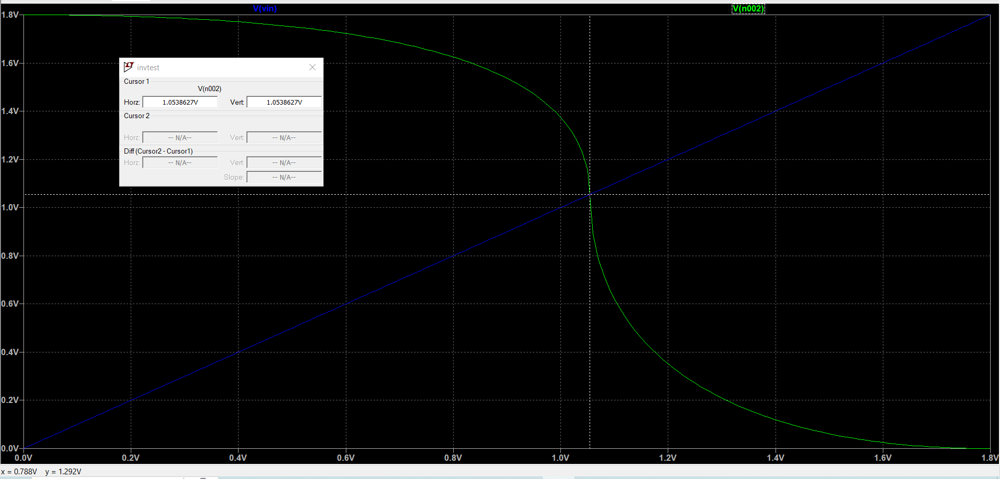

# CMOS-inverter
### Design and Analysis of CMOS inverter using LT-Spice and TSMC 180nm.lib
***
***This is my first repository and i hope to post more projects and electronic simultaions,vlsi stuffs. I do appreicate contributions from others during this phase of learning.I will try to keep updating it as often as possible.***
***

This project describes the working of the basic inverter, its characteristics,input-output relations, parameter varations etc.. i have used LT-spice for my simulation of the circuits and to also to analayse and verify the outputs. Ive included the tsmc180nm tech/model file in my simultaions.
I always aim to understand the the circuits,devices right from the basic and then progress to the higher levels, Here in this project to I've aimed to acomplish the same.The projects kicks of from the Voltage Tranfer Characterstics,Transient Analysis and also the Power Dissipation associated eith the inverter.So lets jump right in to it.

**Note:-
      PMOS width Wp=800nm and NMOS width Wn=400nm**
      Ive kept these width through out the project.
***
### Contents

- [ 1. INVERTER Design and Analysis ](#1-INVERTER-Design-and-Analysis)
  - [1.1 CMOS Inverter](#11-CMOS-Inverter)
  - [1.2 Inverter Symbol](#12-Inverter-Symbol)
  - [1.3 Voltage Transfer Characteristics (VTC)](#13-Voltage-Transfer-Characteristics-(VTC))
- [2. Parameter Variations and its Analysis](#2-Parameter-Variations-and-its-Analysis)
  - [2.1 VDD Variation](#21-VDD-Variation)
  - [2.2 PMOS Width(Wp) Variation](#22-PMOS-Width(Wp)-Variation)
  - [2.3 NMOS Width(Wn) Variation](#23-NMOS-Width(Wn)-Variation)

***

## 1. INVERTER Design and Analysis
###### 1.1 CMOS Inverter
 
.
.

###### 1.2 Inverter Symbol
 

###### 1.3 Voltage Transfer Characteristics (VTC)
**Schematic**
 
**Output**
 

## 2. Parameter Variations and its Analysis
###### 2.1 VDD Variation
**Schematic**
 
**Output**
 

###### 2.2 PMOS Width(Wp) Variation
**Schematic**
 
 
**Output**
 

###### 2.3 NMOS Width(Wn) Variation
**Schematic**
 
 
**Output**
 

  
